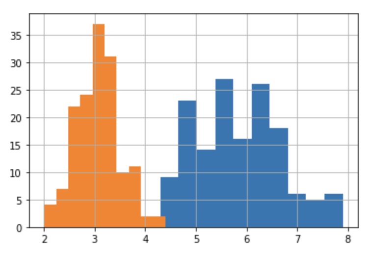

# Logistic Regression for multi-classification problems

## Brief Explanation

Logistic regression, by default, is limited to two-class classification problems. Some extensions such as one-vs-rest can allow logistic regression to be used for multi-class classification problems, although they require that the classification problem first be transformed into several binary classification problems.

Instead, the multinomial logistic regression algorithm is an extension of the logistic regression model that involves changing the loss function into a cross-entropy loss and the prediction probability distribution into a multinomial probability distribution to natively support multi-class classification problems.

<b>The aims of this project is to implement logistic regression from scratch for multi-classification problems by using Iris Dataset.</b>
[](https://colab.research.google.com/drive/1Ye4LOwxjGhqjhNHge4lXuzMIyLkJHNY9?usp=sharing)
<br>
<!DOCTYPE html>
<html>
<style>
<!-- img.displayed {
    display: block;
    margin-left: auto;
    margin-right: auto }
</style> -->
<body>
<figure >
 
  <figcaption style="text-align : center; color:yellow"><h4>Data visualization in 2 Dimensions</h4></figcaption>
</figure>
</body>
</html>


<!DOCTYPE html>
<html>
<style>
table, th, td {
  border:3px solid greenk;
}
</style>
<body>

<h2>Histogram</h2>
<table style="width:100%">
  <tr>
    <td></td>
    <td></td>
  </tr>
 
</table>
<p style="text-align : center; color:yellow">These two histograms show the main characteristics of the data distribution in a practical way.</p>

</body>
</html>

# Install the Project

```
$ https://github.com/Junior-081/Logistic-Regression-for-Mulclassification-.git
```

```
$ cd Logistic-Regression-for-Mulclassification-.git
```
# Virtual environment

## Mac OS

### Create virtual environment 

```
$ python3 -m venv NAME_ENV
```
### Activate your environment 

```
$ source NAME_ENV/bin/activate
```

## Linux OS

### Create virtual environment

```
$ conda create -n venv NAME_ENV
```

### Activate your environment 

```
$ activate NAME_ENV
```

# Requirement installations
To run this, make sure to install all the requirements by:

```
$ pip install -r requirements.txt 
```
# Running the model
You make sure that you have version 3 of python

To train the model with the three targets (setosa, versicolor, virginica), it is necessary to train the model by taking all the features with the target one after the other and save the probability.

Now you have to change the target for the training and for the test. Example : train.iloc[:,-3], test.iloc[:,-3] = setosa, train.iloc[:,-2], test.iloc[:,-2] = versicolor, train.iloc[:,-1], test.iloc[:,-1] = virginica


To train and To test
```
$ python3 main.py

```


# Autor #
<div style="display:flex;align-items:center">

<div style="display:flex;align-items:center">
    <div>
        <h5> <a href='https://www.linkedin.com/in/junior-kaningini-a02442196/'>Junior Kaningini</a> </h5> 
<div>
    
</div>

